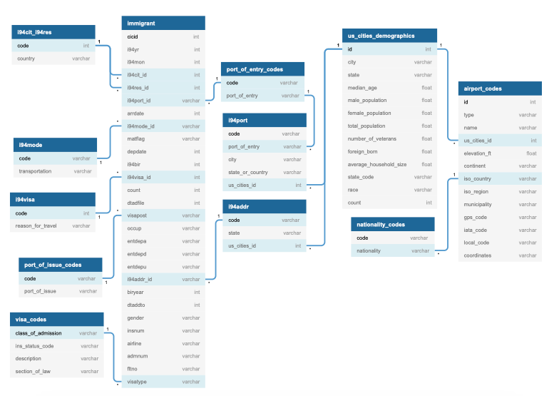
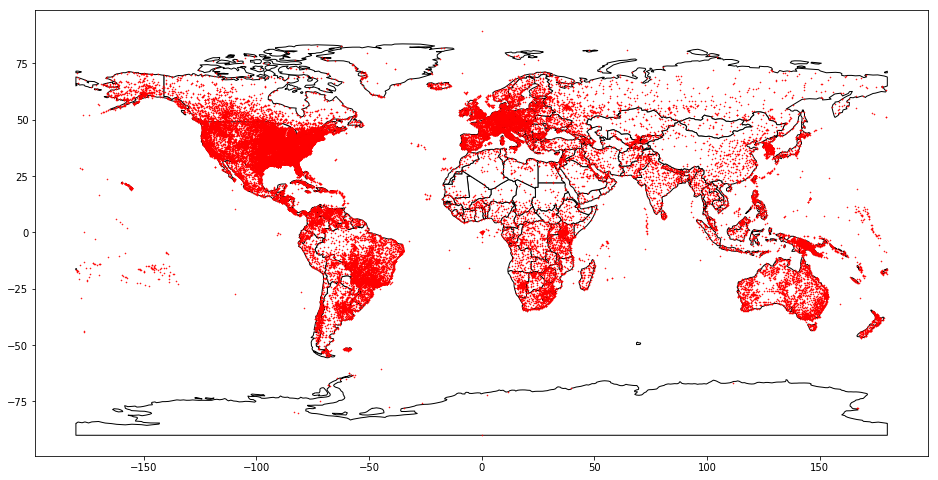

# Data Engineering Capstone Project

## Scope of Works
The purpose of this project is to demonstrate various skills associated with data engineering projects. In particular, developing ETL pipelines using Airflow, constructing data warehouses through Redshift databases and S3 data storage as well as defining efficient data models e.g. star schema. As an example I will perform a deep dive into US immigration, primarily focusing on the type of visas being issued and the profiles associated. The scope of this project is limited to the data sources listed below with data being aggregated across numerous dimensions such as visatype, gender, port_of_entry, nationality and month.

Further details and analysis can be found [here](./capstone_notebook.ipynb)

## Data Description & Sources
- I94 Immigration Data: This data comes from the US National Tourism and Trade Office found [here](https://travel.trade.gov/research/reports/i94/historical/2016.html). Each report contains international visitor arrival statistics by world regions and select countries (including top 20), type of visa, mode of transportation, age groups, states visited (first intended address only), and the top ports of entry (for select countries).
- World Temperature Data: This dataset came from Kaggle found [here](https://www.kaggle.com/berkeleyearth/climate-change-earth-surface-temperature-data).
- U.S. City Demographic Data: This dataset contains information about the demographics of all US cities and census-designated places with a population greater or equal to 65,000. Dataset comes from OpenSoft found [here](https://public.opendatasoft.com/explore/dataset/us-cities-demographics/export/).
- Airport Code Table: This is a simple table of airport codes and corresponding cities. The airport codes may refer to either IATA airport code, a three-letter code which is used in passenger reservation, ticketing and baggage-handling systems, or the ICAO airport code which is a four letter code used by ATC systems and for airports that do not have an IATA airport code (from wikipedia). It comes from [here](https://datahub.io/core/airport-codes#data).

After extracting various immigration codes from the  `I94_SAS_Labels_Descriptions.SAS` file, I was able to define a star schema by extracting the immigration fact table and various dimension tables as shown below:

Additionally, airports associated with `port_of_entry` could be identified through the `Airport Code Table`. The table is exhaustive and extends well beyond just the US as highlighted below:

## Data Storage

Data was stored in S3 buckets in a collection of CSV and PARQUET files. The immigration dataset extends to several million rows and thus this dataset was converted to PARQUET files to allow for easy data manipulation and processing through Dask and the ability to write to Redshift.  

Dask is an extremely powerful and flexible library to handle parallel computing for dataframes in Python. Through this library, I was able to scale pandas and numpy workflows with minimal overhead. Whilst PySpark is a great API to Spark and tool to handle big data, I also highly recommend Dask, which you can read more about [here](https://dask.org/).

## ETL Pipeline

Defining the data model and creating the star schema involves various steps, made significantly easier through the use of Airflow. The process of extracting files from S3 buckets, transforming the data and then writing CSV and PARQUET files to Redshift is accomplished through various tasks highlighted below in the ETL Dag graph. These steps include:
- Extracting data from SAS Documents and writing as CSV files to S3 immigration bucket
- Extracting remaining CSV and PARQUET files from S3 immigration bucket
- Writing CSV and PARQUET files from S3 to Redshift
- Performing data quality checks on the newly created tables

## Conclusion
Overall this project was a small undertaking to demonstrate the steps involved in developing a data warehouse that is easily scalable. Skills include:
* Creating a Redshift Cluster, IAM Roles, Security groups.
* Developing an ETL Pipeline that copies data from S3 buckets into staging tables to be processed into a star schema
* Developing a star schema with optimization to specific queries required by the data analytics team.
* Using Airflow to automate ETL pipelines using Airflow, Python, Amazon Redshift.
* Writing custom operators to perform tasks such as staging data, filling the data warehouse, and validation through data quality checks.
* Transforming data from various sources into a star schema optimized for the analytics team's use cases.
